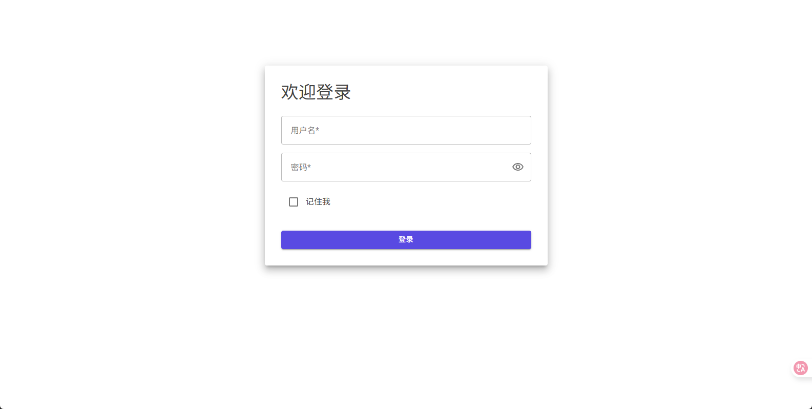
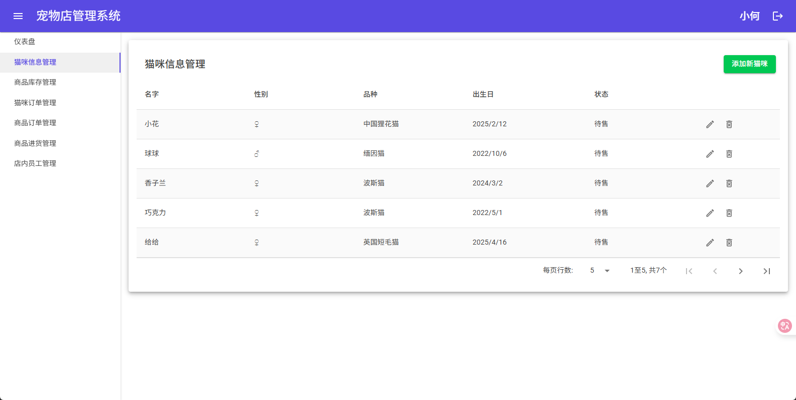
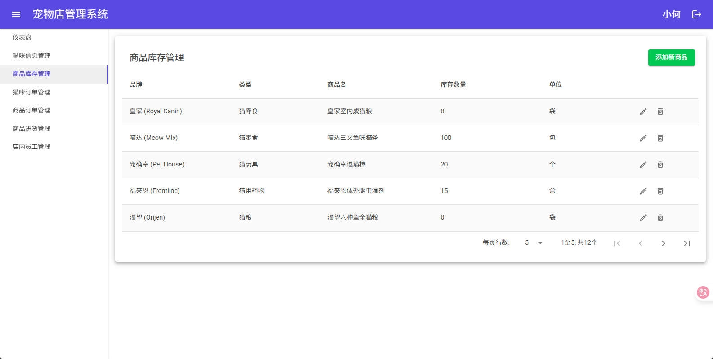
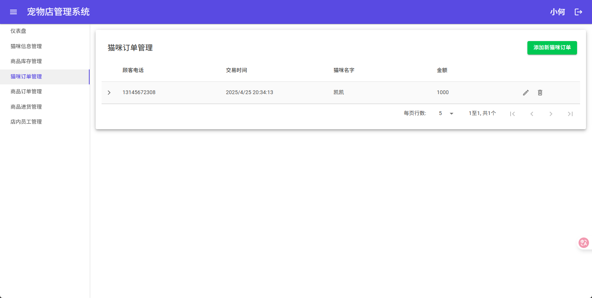
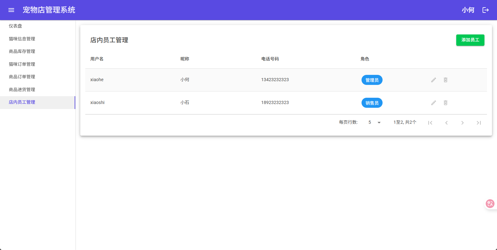

# 项目简介

这是一个猫咪及猫咪用品专卖店的管理系统。

本项目基于 ASP.NET Blazor in .NET9（交互式服务器端渲染） ，使用了 Individual Authentication （个人身份验证） 。前端使用 MudBlazor 。

数据库使用 SQLite ，当然你可以轻松借助 EF Core 使用其他数据库。

本项目尽可能精简了将身份认证融入项目的代码。相较于 .NET 的官方模板，本项目更适合初学者理解 Blazor 中的身份验证。

同时，本项目拥有完善的注释，适合作为 Blazor 初学者学习使用。

# 功能模块概述

本项目实现了以下几个功能模块：

1. **猫咪信息管理**

管理猫咪名字、品种、出生日等信息，其中销售状态根据是否存在此猫咪相关的订单确定。

2. **猫咪品种管理**

管理猫咪品种名、品种备注等信息，与猫咪信息管理功能关联。

3. **商品信息管理**

管理店中商品的信息，如品牌、名称、种类等。商品库存数量会根据相关销售订单和进货订单动态变化。

4. **猫咪订单管理**

管理猫咪订单的信息，如交易时间、顾客电话、交易金额等信息。每个订单管理具体订单项，记录购买的猫咪。

5. **商品订单管理**

管理商品订单的信息，如交易时间、顾客电话、交易金额等信息。每个订单管理具体订单项，记录购买的商品和数量。

6. **商品进货管理**

管理商品进货订单的信息，如交易时间、供货商电话、交易金额等信息。每个订单管理具体订单项，记录进货商品和数量。

7. **到店预约管理**

管理顾客到店预约信息，如到店时间、顾客称呼、备注等信息。

8. **店内员工管理**

管理店内员工信息，如用户名、电话、昵称等，同时，每名员工都可以以其被分配的角色登录本系统。

# 访问控制

本项目实现了基于角色（`Role`）的访问控制，有以下角色：

1. 管理员（`admin`）

拥有以上模块的完整权限。

2. 销售员（`salesman`）

仅拥有对订单管理和预约管理的完整权限，以及对猫咪信息和商品信息的查询权限。

# 截图

## 登录

## 猫咪信息管理

## 商品信息管理

## 猫咪订单管理

## 商品订单管理

## 商品进货管理

## 店内员工管理

# 部署

本项目集成了 SQLite 数据库，可直接运行。

如需更换数据库，使用 EF Core 迁移即可。运行时，将自动填充初始数据。

> 初始账号
> 
> 管理员：
> 账号：xiaohe
> 密码：Aa.123456
>
> 销售员：
> 账号：xiaoshi
> 密码：Aa.123456

> 注意
> 
> 本项目使用 `Data/SeedData.cs` 自动填充初始数据，您可以清空数据库内容后，自行修改初始账号等初始数据。

